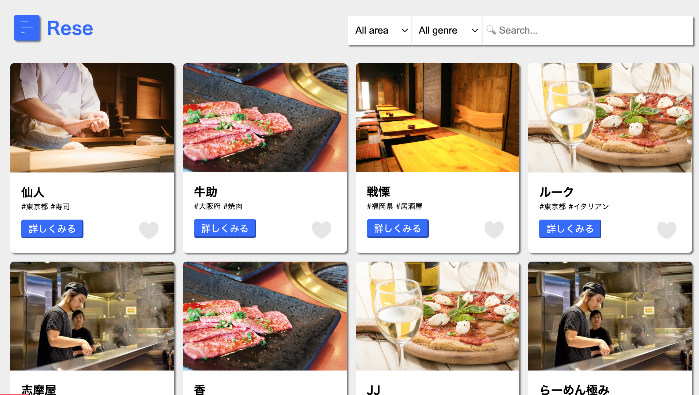
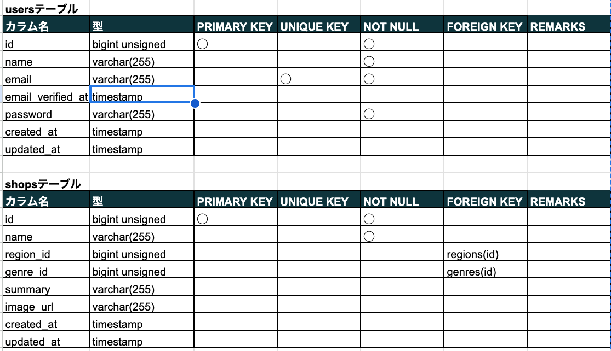
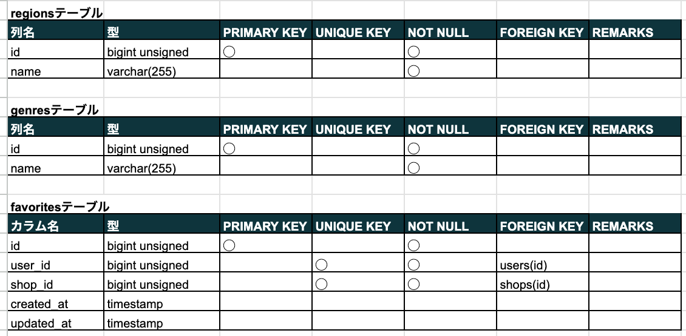
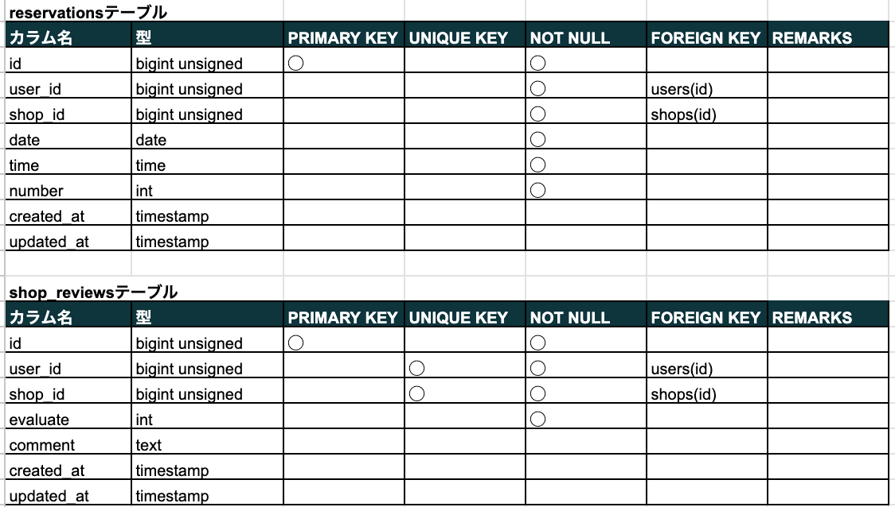
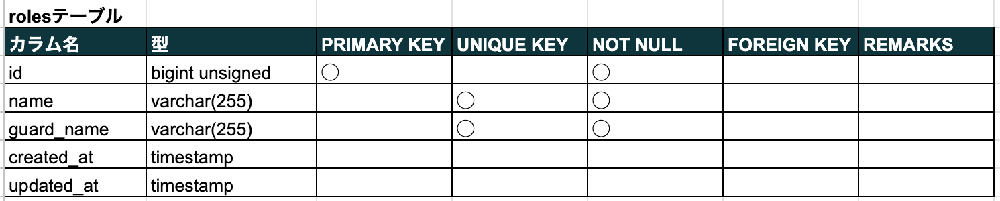
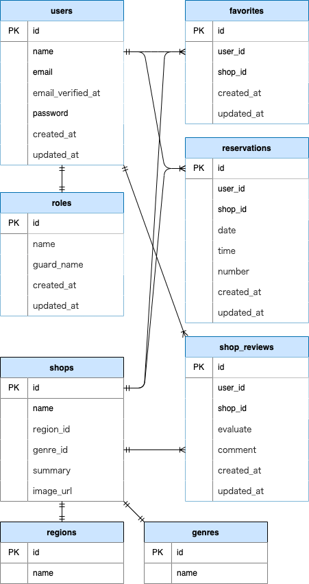

# 飲食店予約システム
飲食店の詳細を閲覧したり、飲食店の予約をできるアプリです。

## 作成目的
外部の飲食店予約サービスは手数料を取られるので自社で予約サービスを持ちたいため。

## アプリケーションURL
- 開発環境：http://localhost/
- phpMyAdmin：http://localhost:8080/
- MailHog：http://localhost:8025/
  ※メール認証時、お知らせメール送信時、予約確認のリマインダー時はMailHogで確認する

## 機能一覧
- 会員登録
- ログイン
- ログアウト
- ユーザー情報取得
- ユーザー飲食店お気に入り一覧取得
- ユーザー飲食店予約情報取得
- 飲食店一覧取得
- 飲食店詳細取得
- 飲食店お気に入り追加
- 飲食店お気に入り削除
- 飲食店予約情報追加
- 飲食店予約情報削除
- エリア検索
- ジャンル検索
- 店名検索

## 追加機能一覧
- 飲食店予約情報変更
- 評価機能
- 管理者用ユーザー管理
- 店舗代表者用飲食店情報管理
- メール認証機能
- お知らせメール送信機能
- 予約確認のリマインダー機能（予約当日の9時に送信）
- 予約情報QRコード表示

## 使用技術(実行環境)
- PHP 7.4.9
- Laravel 8.83.8
- MySQL 10.3.39
- jQuery 3.4.1

## テーブル設計

## ER図

## 環境構築
Dockerビルド
1. git clone git@github.com:Ruchida123/Rese.git
2. docker-compose up -d --build

※MySQLは、OSによって起動しない場合があるのでそれぞれのPCに合わせてdocker-compose.ymlを編集してください。

Laravel環境構築
1. docker-compose exec php bash
2. composer install
3. env/.env.devファイルの、環境変数を変更 ・・・①
4. php artisan key:generate
5. php artisan migrate
6. php artisan db:seed
7. php artisan storage:link
8. php artisan schedule:work（リマインダー機能確認用）

① 環境変数の設定（DB関連は割愛）
1. 「MAIL_FROM_ADDRESS」に任意のメールアドレスを設定（例：sample@example.com）
2. 「STRIPE_KEY」にStripeのAPIキーの公開可能キーを設定
3. 「STRIPE_SECRET」にStripeのAPIキーのシークレットキーを設定
4. 「CASHIER_CURRENCY」に「jpy」を設定

## アカウントの種類（テストユーザー）
| 権限 | メールアドレス | パスワード |
| -------- | --------- | --------- |
| 管理者 | admin1@test.com | password |
| 店舗代表者 | represent1@test.com | password |
| 利用者 | user1@test.com | password |

※権限ごとに利用できる機能は異なる

管理者
- ユーザの管理
- 利用者、店舗代表者の作成（登録）
- 利用者へのお知らせメール送信

店舗代表者
- 店舗の管理
- 店舗情報の作成（登録）、更新、予約情報の確認

利用者
- 飲食店お気に入り追加
- 飲食店予約
- 飲食店予約情報変更
- 飲食店評価
- QRコード表示
- 決済